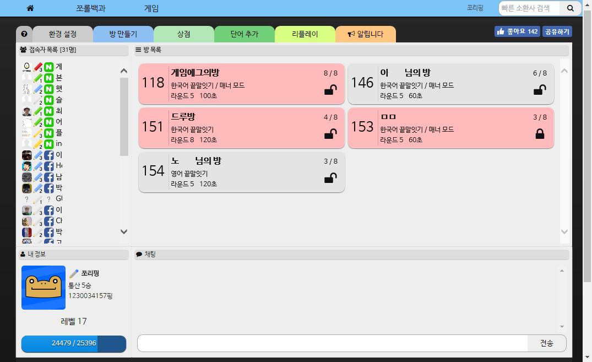
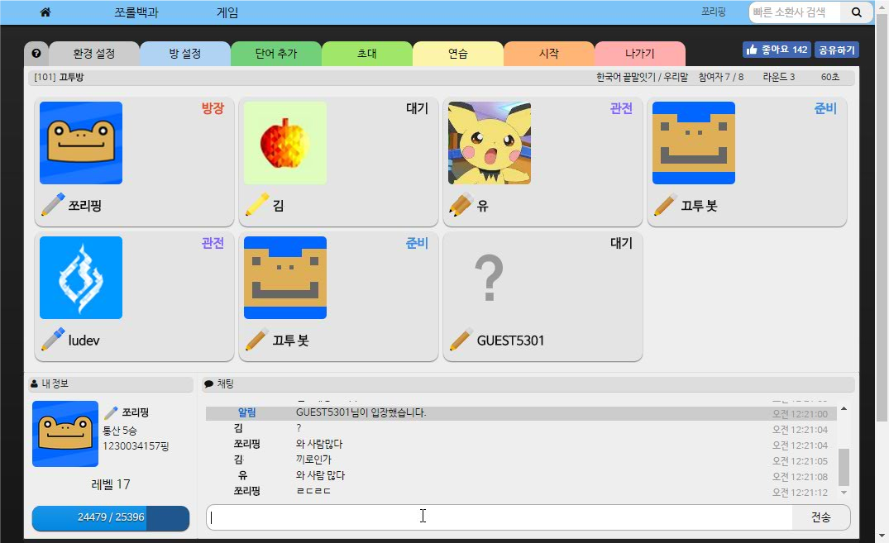
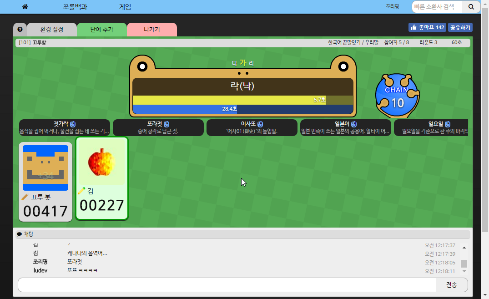

# KKuTu

글자로 놀자! **끄투 온라인( KK uTu Online )** 서버 저장소입니다.  
This is the source repository for **KKuTu Online** server.

- Original creator: [JJoriping](http://blog.jjo.kr/)
- Wiki: https://github.com/jeong-jimin-github/KKuTu/wiki
- Languages: [한국어](#한국어) · [English](#english)

---

## 스크린샷 / Screenshots

| Lobby | Room | Team |
|---|---|---|
|  |  |  |

| Game | Mission | Replay |
|---|---|---|
|  |  |  |

---

## 한국어

### 소개

**끄투**는 어휘력 기반의 멀티플레이 단어 게임입니다.  
이 저장소는 서버를 직접 설치/운영하려는 사용자를 위한 소스 코드와 리소스를 제공합니다.

### 요구 사항

- Node.js (권장: 18 이상)
- npm
- SQLite (파일 기반 DB, 외부 PostgreSQL/Redis 불필요)

### 빠른 시작 (Windows)

1. 저장소를 클론/다운로드합니다.
2. `npm install -g grunt grunt-cli` 를 실행합니다.
3. 루트에서 `server-setup.bat` 를 실행합니다.
4. `Server/lib/sub/auth.json`, `Server/lib/sub/global.json` 파일을 생성/수정합니다.
5. `Server/run.bat` 를 실행합니다.

### 빠른 시작 (Linux/macOS)

1. 저장소를 클론합니다.
2. `npm install -g grunt grunt-cli` 를 실행합니다.
3. `cd Server && node setup`
4. `cd Server/lib && npx grunt default pack`
5. `Server/lib/sub/auth.json`, `Server/lib/sub/global.json` 파일을 생성/수정합니다.
6. 서버 실행:
   - 게임 서버: `node Server/lib/Game/cluster.js 0 1`
   - 웹 서버: `node Server/lib/Web/cluster.js 1`

### 필수 설정 (`Server/lib/sub/global.json`)

아래 항목을 반드시 맞춰 주세요.

- `SQLITE_PATH`: SQLite DB 파일 경로 (예: `/kkutu/kkutu.db`)
- `MAIN_PORTS`, `GAME_SERVER_HOST`, `ADMIN` 등 서버 운영 기본값
- HTTPS 사용 시 `IS_SECURED`, `SSL_OPTIONS`

> 참고: 기존 PostgreSQL/Redis 기반 설정 없이 동작하도록 구성되어 있습니다.

### 데이터/도구

- 일본어 사전 반영:
  - `node tools/import_jmdict.js <JMdict_e.gz 경로> <sqlite 스키마 파일 경로>`
- 일본어 테이블 반영 스크립트:
  - `node tools/apply_japanese_db.js` (환경 설정 필요)
- 애니메이션 어인정 단어 보강:
  - `python3 tools/import_anime_db.py`
- 단어 테마 GUI:
  - `python3 tools/word_theme_gui.py`

### Docker Compose

`docker-compose.yml`은 SQLite 볼륨(`kkutu_data`)을 사용하도록 구성되어 있습니다.

- `web`, `game` 서비스에 `SQLITE_PATH=/kkutu/kkutu.db` 적용
- 별도 PostgreSQL 컨테이너 없이 실행

### 라이선스

- 소스 코드: [GNU GPL-3.0](LICENSE)
- 이미지/사운드: [CC BY 4.0](https://creativecommons.org/licenses/by/4.0/)

---

## English

### Overview

**KKuTu** is a multiplayer word game platform.  
This repository contains server code and assets for self-hosting.

### Requirements

- Node.js (recommended: 18+)
- npm
- SQLite (file-based DB, no external PostgreSQL/Redis required)

### Quick Start (Windows)

1. Clone/download this repository.
2. Run `npm install -g grunt grunt-cli`.
3. Run `server-setup.bat` in the repository root.
4. Create/update `Server/lib/sub/auth.json` and `Server/lib/sub/global.json`.
5. Run `Server/run.bat`.

### Quick Start (Linux/macOS)

1. Clone this repository.
2. Run `npm install -g grunt grunt-cli`.
3. `cd Server && node setup`
4. `cd Server/lib && npx grunt default pack`
5. Create/update `Server/lib/sub/auth.json` and `Server/lib/sub/global.json`.
6. Start servers:
   - Game: `node Server/lib/Game/cluster.js 0 1`
   - Web: `node Server/lib/Web/cluster.js 1`

### Required Config (`Server/lib/sub/global.json`)

Please set at least:

- `SQLITE_PATH`: SQLite DB file path (e.g. `/kkutu/kkutu.db`)
- server basics such as `MAIN_PORTS`, `GAME_SERVER_HOST`, `ADMIN`
- HTTPS options (`IS_SECURED`, `SSL_OPTIONS`) if needed

### Data Utilities

- Import/update Japanese dictionary:
  - `node tools/import_jmdict.js <path-to-JMdict_e.gz> <path-to-sqlite-schema-file>`
- Apply Japanese DB section:
  - `node tools/apply_japanese_db.js` (requires proper environment config)
- Import anime-themed injeong corpus:
  - `python3 tools/import_anime_db.py`
- Word theme GUI:
  - `python3 tools/word_theme_gui.py`

### Docker Compose

The included `docker-compose.yml` uses SQLite volume storage (`kkutu_data`):

- `web` and `game` services use `SQLITE_PATH=/kkutu/kkutu.db`
- no separate PostgreSQL container is required

### License

- Source code: [GNU GPL-3.0](LICENSE)
- Images and sounds: [CC BY 4.0](https://creativecommons.org/licenses/by/4.0/)
